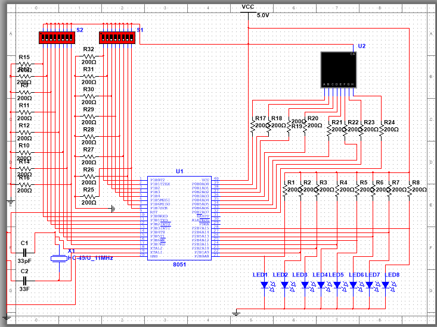
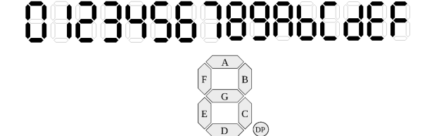
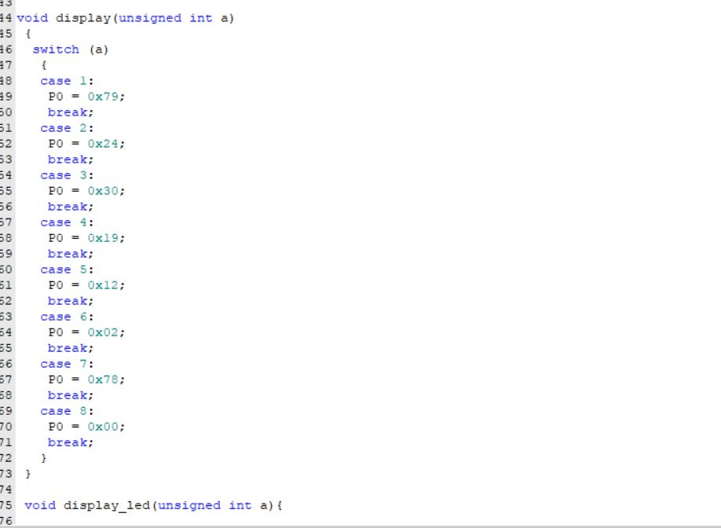
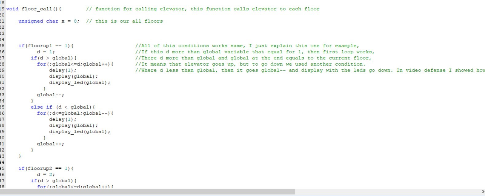
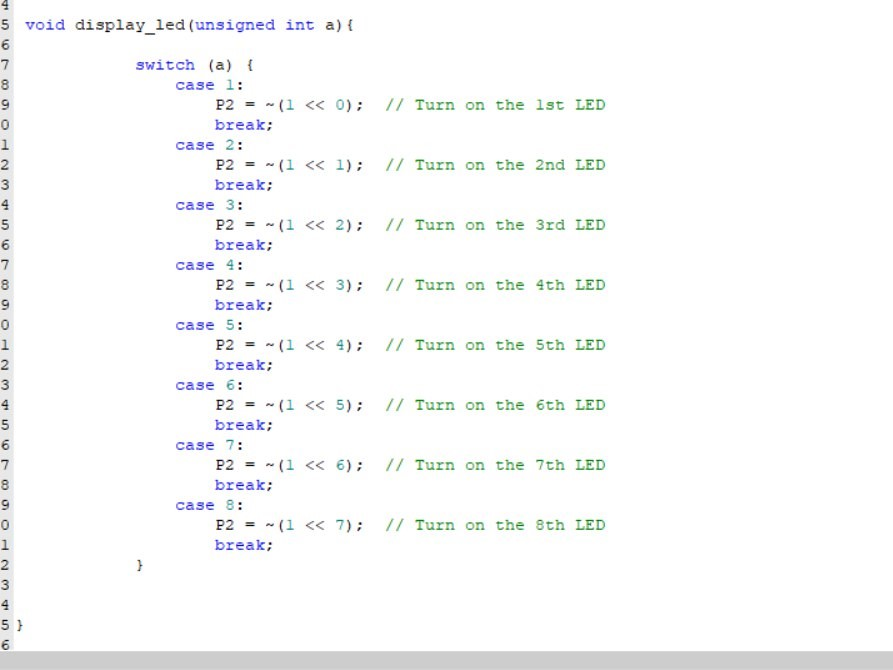
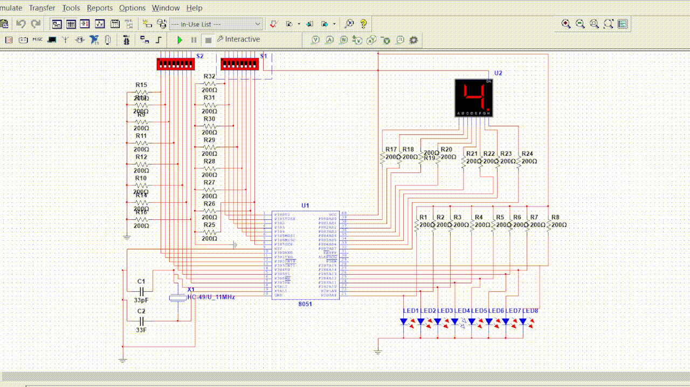

# 🚀 Elevator Simulation System

## 📌 Project Overview

This project is the final assignment for the course, aimed at creating a **simplified elevator simulation system** using **Multisim** and **C programming**. The goal is to design a functional elevator model that operates across 8 floors with a visual representation through a **7-segment display and LED indicators**.

---

## 🎛️ Multisim Circuit Design

### 🔹 Circuit Diagram



### 🔹 Key Components
- **8051 Microcontroller** – Controls the elevator's movement.
- **Resistors & LEDs** – Indicate floor selection and current position.
- **7-Segment Display** – Shows the current floor.
- **Switches** – Used for elevator calls and floor selection.

### 🔹 System Description
- The **elevator has 8 floors** and a **7-segment display** to indicate the current floor.
- **8 LED lamps** sequentially light up to provide an additional visual representation of the floor.
- **8 floor selection switches** allow the user to request an elevator.
- **2 input ports & 2 output ports** are utilized.
- **Port 0 requires pull-up resistors**, while Ports 1, 2, and 3 do not.

The **8051 microcontroller** detects button presses and determines the floor selection. The system then updates the **elevator state**, moving **up or down** accordingly. The **display and LEDs are updated** dynamically to reflect the elevator's position.

---

## 🔢 HEX Conversion for 7-Segment Display

A **7-segment display** consists of **7 LEDs** arranged to represent numbers.



For each floor, the corresponding **HEX conversion values** are:
```
0x9F, 0x25, 0x0D, 0x99, 0x49, 0x41, 0x1F, 0x01
```

---

## 🖥️ Code Implementation

### 1️⃣ **Display Function**

```c
void display(unsigned int a) {
    switch (a) {
        case 1: P0 = 0x79; break;
        case 8: P0 = 0x00; break;
    }
}
```

This function updates the **7-segment display** based on the **selected floor**.



### 2️⃣ **Floor Call Function**

```c
void floor_call(unsigned int d) {
    while (global != d) {
        if (d > global) global++;
        else global--;
        display(global);
        display_led(global);
    }
}
```

This function handles **elevator movement**:
- Checks the **destination floor** (`d`).
- Moves **up or down** based on the **current floor** (`global`).
- Updates the **display and LED indicators**.



### 3️⃣ **LED Display Function**

```c
void display_led(unsigned int a) {
    switch (a) {
        case 1: P2 = ~(1 << 0); break;
        case 2: P2 = ~(1 << 1); break;
    }
}
```

This function controls the **LED indicators**:
- Uses **bitwise operations** to activate LEDs based on the **selected floor**.
- Each LED corresponds to a **floor number**.



---

## 🎥 Demonstration  
The working system is demonstrated in a **video defense**, showcasing the complete **elevator simulation** in action.  




---

## 📌 Conclusion
This project provides a **functional elevator simulation system** using:
✅ **Multisim for circuit design**
✅ **8051 Microcontroller for control**
✅ **7-Segment Display & LEDs for visualization**
✅ **C programming for logic implementation**

This serves as a **foundation** for **real-world elevator control systems**! 🚀